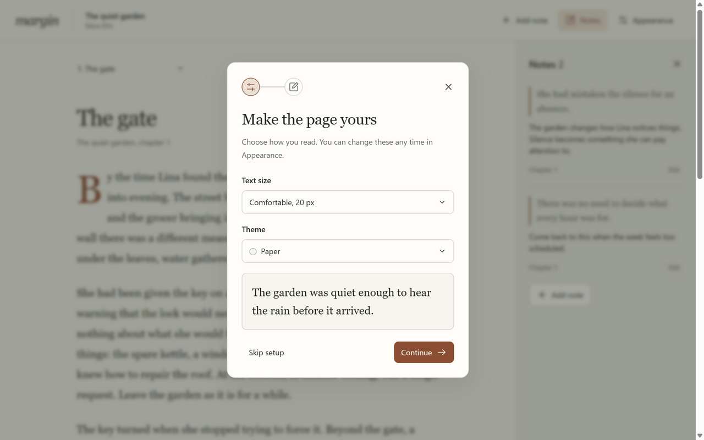

# Personal skills

Agent skills and their resources. This repository is private because its reference library includes personal screenshots and collected design examples.

## Personal UI

`personal-ui` preserves general visual preferences, Ada and Cloak lessons, repertoire examples, motion and interaction rules, installer design and README guidance. Product-specific choices remain separate. A book reader need not look like Cloak.

The library travels with the skill. `personal-ui/references/examples/index.json` maps selected PDF frames to their sources. These are private references, not artwork to redistribute in applications. Owned app artwork stays in its product repo.

| Resource | Purpose |
| --- | --- |
| [Preferences](personal-ui/references/preferences.md) | General taste and dated product feedback. |
| [Desktop patterns](personal-ui/references/desktop-patterns.md) | Controls, menus, setup, grouping and native window boundaries. |
| [Motion](personal-ui/references/motion.md) | Springs, real state, first-render behavior and reduced motion. |
| [Repertoire](personal-ui/references/repertoire.md) | Curated visual examples, source mapping and complete source PDFs. |
| [READMEs](personal-ui/references/readmes.md) | Product presentation, user starting points and linked guides. |
| [Validation](personal-ui/references/validation.md) | Independent task, outcomes and evidence limits. |

## Tested beyond Cloak

The forward test produced a warm book reader rather than another dark utility. The same dropdown, onboarding and note-action principles still apply.



## Install on each Windows PC

Use a Git clone outside OneDrive. GitHub CLI must have access to this private repository.

```powershell
gh repo clone zF4ke/skills "$env:USERPROFILE\Projects\skills"
powershell.exe -NoProfile -ExecutionPolicy Bypass -File "$env:USERPROFILE\Projects\skills\install.ps1"
```

This installs the whole skill in `%USERPROFILE%\.codex\skills\personal-ui`. Codex can discover it on the next turn. Invoke `$personal-ui` or let the skill description match relevant design work. Start at [SKILL.md](personal-ui/SKILL.md).

Pass `-SkillsFolder <folder>` to install into another agent's actual discovery folder. The script copies the complete directory with resources.

## Update

```powershell
git -C "$env:USERPROFILE\Projects\skills" pull --ff-only
powershell.exe -NoProfile -ExecutionPolicy Bypass -File "$env:USERPROFILE\Projects\skills\install.ps1"
```

Edit the Git checkout, update the relevant reference, commit and reinstall. Installation is a copy, not a OneDrive link. Current instructions override historical preferences.

## Skill test

[Validation notes](personal-ui/references/validation.md) describe a book-reader task given to an independent agent. [The self-contained example](examples/reader/index.html) and paper/night screenshots show a different product using the same interaction lessons. Open the HTML to test themes, fonts and notes. This is one forward test, not a guarantee of every future design.
